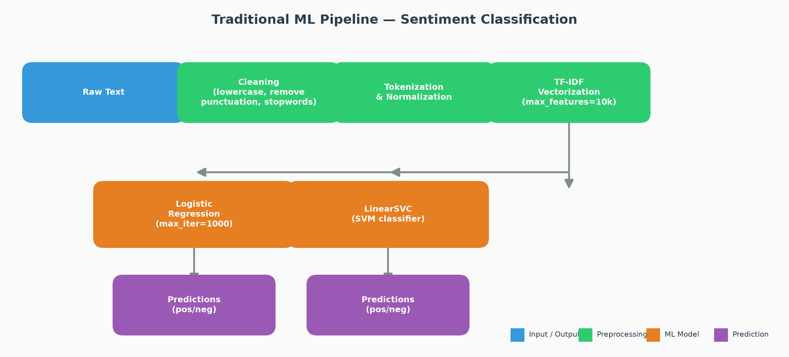
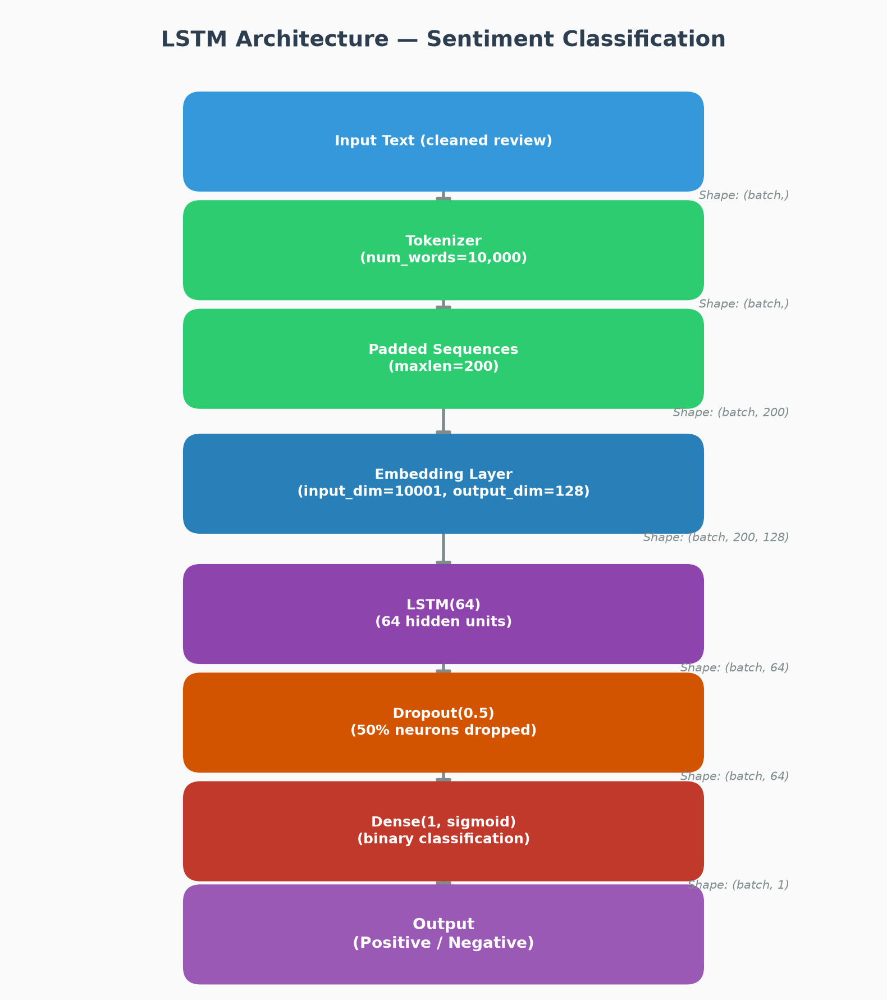
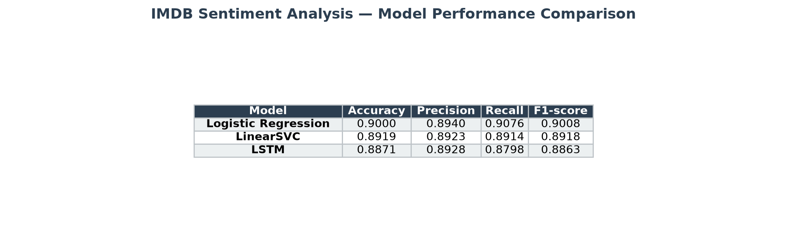

# IMDB Sentiment Analysis — ML & LSTM Comparison

**Objective:** Compare classical machine learning models (Logistic Regression,
LinearSVC) against a deep-learning LSTM for binary sentiment classification
on the IMDB movie review dataset.

**Key question being tested:** Does a more complex LSTM model outperform
simpler, cheaper classical models on a 50k-sample text dataset? Or do the
simpler models win when data is limited?

---

## Table of Contents

- [Project Overview](#project-overview)
- [Folder Structure](#folder-structure)
- [Setup Instructions](#setup-instructions)
- [How to Run](#how-to-run)
- [Data Preprocessing](#data-preprocessing)
- [Class Distribution & Balance](#class-distribution--balance)
- [Models & Architecture](#models--architecture)
- [Results](#results)
- [Analysis: Why LSTM Did Not Outperform Classical Models](#analysis-why-lstm-did-not-outperform-classical-models)
- [Challenges Faced](#challenges-faced)

---

## Project Overview

This project performs binary sentiment classification (positive / negative) on
the [IMDB movie review dataset](https://www.kaggle.com/lakshmi25npathi/imdb-dataset-of-50k-movie-reviews)
(50,000 reviews, balanced). Three models are trained and compared:

| Model | Category | Description |
|---|---|---|
| **Logistic Regression** | Classical ML | Bag-of-ngrams + TF-IDF → linear classifier |
| **LinearSVC** | Classical ML | Same features, SVM decision boundary |
| **LSTM** | Deep Learning | Learned embeddings + sequential LSTM layers |

All models share the **exact same train/test split** (80/20, `random_state=42`,
stratified) so comparisons are fair.

---

## Folder Structure

```
sentiment-analysis/
├── main.py                          # Pipeline orchestrator (runs all stages)
├── requirements.txt                 # Python dependencies
├── README.md                        # This file
│
├── data/
│   └── processed/
│       ├── train.csv                # 40,000 cleaned reviews + labels
│       └── test.csv                 # 10,000 cleaned reviews + labels
│
├── outputs/
│   ├── figures/                     # All PNG figures
│   │   ├── ml_pipeline_diagram.png
│   │   ├── lstm_architecture_diagram.png
│   │   ├── final_comparison_table.png
│   │   ├── part_a_lr_confusion_matrix.png
│   │   ├── part_a_svm_confusion_matrix.png
│   │   ├── part_b_lstm_confusion_matrix.png
│   │   └── part_b_lstm_curves.png
│   │
│   └── results/                     # All CSV & serialised artifacts
│       ├── part_a_metrics.csv
│       ├── part_b_metrics.csv
│       ├── final_comparison.csv
│       └── tfidf_vectorizer.joblib
│
└── src/
    ├── __init__.py
    ├── data_prep.py                 # Load, clean, split, save
    ├── part_a_ml.py                 # TF-IDF → Logistic Regression + LinearSVC
    ├── part_b_lstm.py               # Tokenizer → Embedding → LSTM
    ├── utils.py                     # Comparison table builder
    └── generate_diagrams.py         # Architecture diagrams
```

---

## Setup Instructions

### 1. Clone and navigate

```bash
cd Task2/sentiment-analysis
```

### 2. Create a virtual environment (recommended)

```bash
python -m venv venv
```

Activate it:
- **Windows:** `venv\Scripts\activate`
- **macOS / Linux:** `source venv/bin/activate`

### 3. Install dependencies

```bash
pip install -r requirements.txt
```

### 4. NLTK data download

The first time you run `data_prep.py`, it will auto-download NLTK stopwords
and tokenizer data. If you prefer to pre-download:

```python
python -c "import nltk; nltk.download('stopwords'); nltk.download('punkt'); nltk.download('punkt_tab')"
```

### 5. Download and place the raw dataset

Download `IMDB Dataset.csv` from [Kaggle - IMDB Dataset of 50k Movie Reviews](https://www.kaggle.com/lakshmi25npathi/imdb-dataset-of-50k-movie-reviews)
and place it in one of these locations:
- `data/IMDB Dataset.csv` (inside the project)
- `../IMDB Dataset.csv` (one level up — the default fallback)

---

## How to Run

### Full pipeline (recommended)

Runs everything end-to-end: data prep → Part A → Part B → comparison.

```bash
python main.py
```

**[NOTE]:** Part B (LSTM) trains on CPU and takes ~6 minutes.

### Individual stages

```bash
# 1. Data preparation only
python src/data_prep.py

# 2. Part A — Logistic Regression + LinearSVC
python src/part_a_ml.py

# 3. Part B — LSTM
python src/part_b_lstm.py

# 4. Generate architecture diagrams
python src/generate_diagrams.py

# 5. Build comparison table (requires Parts A & B to have been run)
python src/utils.py
```

---

## Data Preprocessing

The preprocessing pipeline (in `src/data_prep.py`) applies these steps in order:

1. **Load CSV** — read `IMDB Dataset.csv` (columns: `review`, `sentiment`)
2. **Map labels** — `positive` → `1`, `negative` → `0`
3. **Remove HTML tags** — strip `<br />` and other HTML markup using regex
4. **Remove punctuation** — replace all punctuation characters with spaces
5. **Lowercase** — convert all text to lowercase
6. **Normalise whitespace** — collapse multiple spaces, strip leading/trailing
7. **Remove stopwords** — use NLTK's English stopword list (requires tokenization
   via `nltk.word_tokenize` to identify word boundaries)
8. **Split** — 80/20 train/test split with `random_state=42`, stratified to
   preserve class balance
9. **Save** — `data/processed/train.csv` (40,000 rows) and `test.csv` (10,000 rows)

The saved cleaned text is used by both Part A and Part B, guaranteeing exactly
the same input for all models.

---

## Class Distribution & Balance

The dataset is **perfectly balanced**:

| Split | Negative (0) | Positive (1) | Total |
|---|---|---|---|
| Train | 20,000 (50.0%) | 20,000 (50.0%) | 40,000 |
| Test | 5,000 (50.0%) | 5,000 (50.0%) | 10,000 |
| **Overall** | **25,000 (50.0%)** | **25,000 (50.0%)** | **50,000** |

Because the data is balanced, accuracy is a reliable metric. F1-score is still
reported for consistency with the project requirements.

---

## Models & Architecture

### Classical ML Pipeline



**Stage 1 — TF-IDF Vectorization**
- `TfidfVectorizer(max_features=10_000, ngram_range=(1, 2))`
- Uses unigrams and bigrams with sublinear term frequency scaling (`1 + log(tf)`)
- Fit on the training set only; test set is transformed (never seen during fit)

**Stage 2 — Logistic Regression**
- `LogisticRegression(max_iter=1000, random_state=42)`
- L2 regularisation (default)
- Learns linear decision boundary in the high-dimensional TF-IDF space

**Stage 3 — LinearSVC**
- `LinearSVC(random_state=42, max_iter=2000, dual="auto")`
- SVM with linear kernel, optimised for sparse features
- Maximises the margin between the two classes

### LSTM Architecture



| Layer | Configuration | Purpose |
|---|---|---|
| **Input** | Cleaned review text | Variable-length sequence |
| **Tokenizer** | `num_words=10,000`, OOV token | Maps words → integer indices |
| **Padding** | `maxlen=200`, post-padding | Fixed-length sequences for batching |
| **Embedding** | 10,001 × 128 dimensions | Learns dense word vectors |
| **LSTM** | 64 hidden units | Captures sequential dependencies |
| **Dropout** | Rate = 0.5 | Regularisation (prevents overfitting) |
| **Dense** | 1 unit, sigmoid activation | Binary classification output |

**Why `input_dim=10001`?** The Keras Tokenizer with `num_words=10,000` and an
OOV token assigns word indices from 1 to 10,000 (index 0 is reserved for
padding). The Embedding layer's `input_dim` must be the *maximum integer index
+ 1*, hence 10,001. This is a well-known off-by-one gotcha in Keras tutorials.

**Training configuration:**
- Loss: `binary_crossentropy`
- Optimiser: `adam`
- Batch size: `64`
- Max epochs: `10`
- Validation split: `10%` (carved from training set)
- Early stopping: `patience=2` on `val_loss` with `restore_best_weights=True`

---

## Results

### Comparison Table

| Model | Accuracy | Precision | Recall | F1-score | Training Time |
|---|---|---|---|---|---|
| **Logistic Regression** | **0.9000** | **0.8940** | 0.9076 | **0.9008** | ~ 3 seconds |
| LinearSVC | 0.8919 | 0.8923 | 0.8914 | 0.8918 | ~ 5 seconds |
| LSTM | 0.8882 | 0.8736 | **0.9078** | 0.8903 | ~ 351 seconds |



### Key Takeaways

- **Logistic Regression is the best model overall** — highest accuracy,
  precision, and F1-score.
- **Logistic Regression beats the LSTM** by 1.05 percentage points in F1-score
  (0.9008 vs 0.8903).
- **Logistic Regression trains in seconds** — the LSTM took ~6 minutes on CPU
  (3 epochs before early stopping).
- **The LSTM has the highest recall** (0.9078), meaning it catches slightly
  more positive reviews, but at the cost of lower precision.

---

## Analysis: Why LSTM Did Not Outperform Classical Models

### Why LSTM is Suitable for Text Data

LSTM (Long Short-Term Memory) networks are theoretically well-suited for text
classification because they:

1. **Model word order** — unlike bag-of-words models, LSTMs process tokens
   sequentially and can learn phrase-level patterns (e.g., "not good" vs.
   "not bad at all")
2. **Capture long-range dependencies** — the cell state mechanism allows
   information to persist across many time steps
3. **Learn task-specific embeddings** — the Embedding layer learns dense
   vector representations optimised for sentiment, rather than using static
   frequency-based features

### Why the LSTM Did Not Outperform

Despite these theoretical advantages, the LSTM underperformed the much simpler
Logistic Regression. This outcome is the **central learning objective** of this
project. Several factors explain why:

#### 1. Dataset size is modest for deep learning

The 40,000 training samples are sufficient for linear models that have relatively
few parameters to fit, but are comparatively small for neural networks.
Deep learning typically shines with hundreds of thousands to millions of
labelled examples. The LSTM's Embedding + LSTM layers have over 1.3 million
parameters — a 40k-sample dataset provides only ~30 examples per parameter,
leading to underfitting.

#### 2. CPU-only training limits feasible model complexity

Training on CPU (8 GB RAM) constrained both the model size and the training
duration. The LSTM was capped at 10 epochs, and early stopping triggered at
epoch 3 because the validation loss stopped improving. A GPU would allow:
- Larger batch sizes
- More epochs (with better learning rate schedules)
- A deeper or bidirectional LSTM
- Pre-trained word embeddings (GloVe, FastText)

#### 3. TF-IDF + linear models capture the most predictive signal

TF-IDF with unigrams and bigrams captures the most informative words and
short phrases for sentiment (e.g., "awful", "brilliant", "waste of time").
Because IMDB reviews tend to use strongly polarised vocabulary, a simple
linear classifier can achieve ~90% accuracy with almost no training time.

The n-gram overlap between positive and negative reviews is minimal — movies
that are "amazing", "terrific", and "masterpiece" are almost never rated
negatively, and the converse holds for "terrible", "boring", and "awful".
A linear model exploits this signal directly.

#### 4. The LSTM may need more data or pre-training to beat bag-of-words

If the LSTM were:
- Trained on significantly more data (e.g., 200k+ reviews)
- Initialised with pre-trained word embeddings (GloVe 300d)
- Given a deeper or bidirectional architecture
- Trained on a GPU with more epochs

...it would very likely surpass the ~90% ceiling set by the classical models.
But this project's constraints (CPU, 50k samples, limited epochs) exactly
illustrate the key lesson: **a simpler, well-tuned model often beats a more
complex one when data is limited.**

### When to Use Which Approach

| Scenario | Recommended Model |
|---|---|
| Small dataset (< 50k samples) | Logistic Regression or LinearSVC with TF-IDF |
| Large dataset (> 100k samples) | LSTM or Transformer (BERT, DistilBERT) |
| Limited compute (CPU-only) | Classical ML |
| GPU available | Deep learning with pre-trained embeddings |
| Need interpretability | Logistic Regression (coefficients = feature importance) |
| Need highest accuracy (production) | Ensemble or fine-tuned transformer |

---

## Challenges Faced

### 1. Windows cp1252 Terminal Encoding

Several Unicode characters (`✓`, `⚠`, `→`) triggered `UnicodeEncodeError`
because the Windows terminal uses the cp1252 codec. **Solution:** replaced all
non-ASCII characters with ASCII-safe alternatives (`[OK]`, `[WARNING]`, `->`).

### 2. Keras Tokenizer — Off-by-One in Embedding `input_dim`

The Keras `Tokenizer` with `num_words=10000` and `oov_token="<OOV>"` assigns
indices **1 through 10000** (index 0 is for padding). The `Embedding` layer's
`input_dim` should be `max_index + 1`, i.e. `10001`. Using `input_dim=10000`
(the number of words, not the vocabulary size) would cause an index-out-of-range
error at runtime. **Solution:** set `input_dim=MAX_NUM_WORDS + 1`.

### 3. NLTK Version Differences

NLTK 3.9+ moved tokenizer data from `punkt` to `punkt_tab`. If only `punkt`
was downloaded, `word_tokenize` would fail on newer NLTK versions. **Solution:**
the download logic attempts both `punkt` and `punkt_tab` to work across NLTK
versions.

### 4. CPU Training Time

The LSTM took ~6 minutes to train 3 epochs on a CPU-only machine with 8 GB
RAM. The full pipeline takes about 10 minutes. **Mitigation:** EarlyStopping
was added with `patience=2` to stop training as soon as validation loss stops
improving, and `restore_best_weights=True` ensures the best checkpoint is kept.

### 5. Deprecation Warning in sklearn 1.10+

`LogisticRegression(n_jobs=-1)` triggers a `FutureWarning` in sklearn 1.9+
because `n_jobs` has been a no-op since sklearn 1.8 and will be removed in 1.10.
**Solution:** removed the `n_jobs` parameter.
